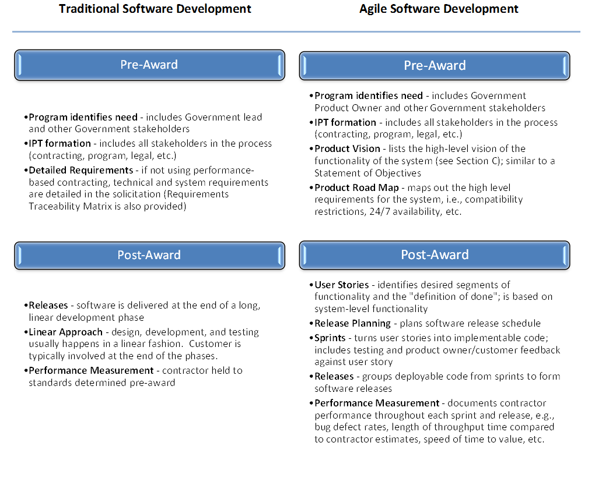
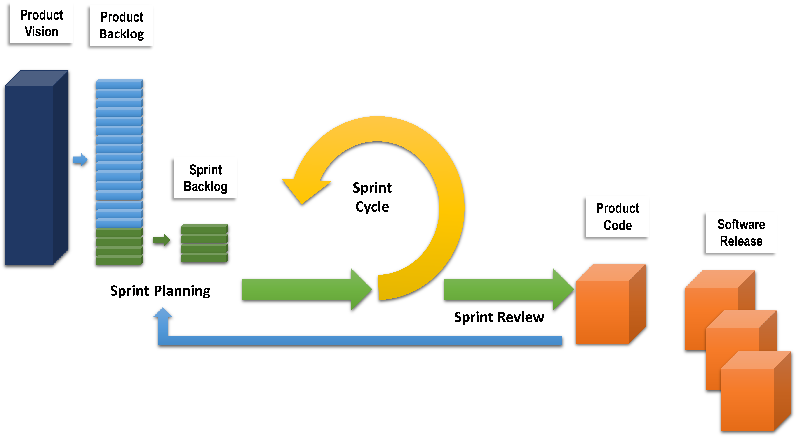
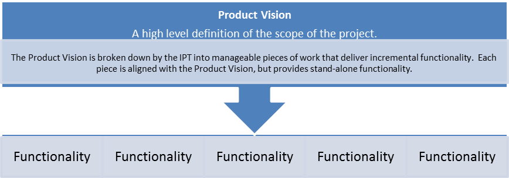
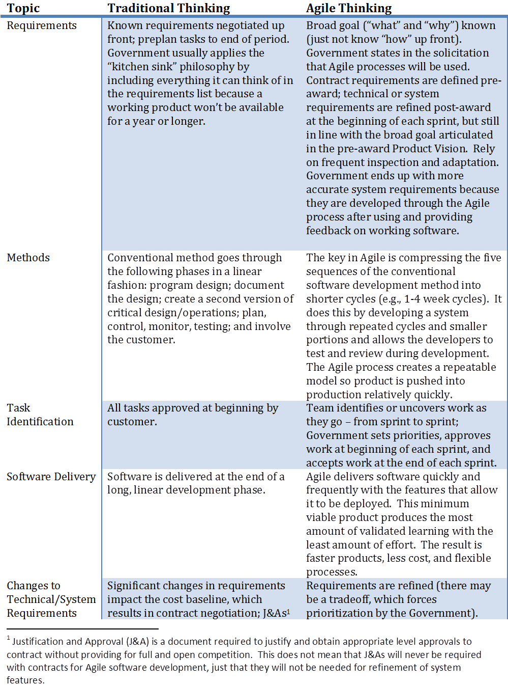

<!-- TechFAR, built from "8 7 14" version  -->

# The TechFAR Handbook for Procuring Digital Services Using Agile Processes

## Executive Summary

In the Government, digital services projects too often fail to meet user expectations or contain unused or unusable features.  Several factors contribute to these outcomes, including the use of outdated development practices and, in some cases, overly narrow interpretations of what is allowed by acquisition regulations.  OMB is developing tools to significantly upgrade the ability of Government digital services to deliver better results to our citizens and improve the way we capitalize on information technology (IT [1]) to better serve the American people.  

One tool is the [Digital Services Playbook](http://playbook.cio.gov "Link to Digital Services Playbook"), which identifies a series of “plays” drawn from proven private sector best practices to help agencies successfully deliver digital services.  Another tool is the TechFAR, which highlights flexibilities [2]  in the Federal Acquisition Regulation (FAR [3]) that can help agencies implement “plays” in the Playbook that would be accomplished with acquisition support.

The vision for the TechFAR is that it will be expanded in future iterations to address many areas of IT.  This edition of the TechFAR is aligned with the [Digital Services Playbook's](http://playbook.cio.gov "Link to Digital Services Playbook") guidance to use contractors to support an iterative development process.  In particular, it emphasizes Agile software development [4],  a technique for doing modular contracting and a proven commercial methodology that is characterized by incremental and iterative processes where releases are produced in close collaboration with the customer.  This process improves investment manageability, lowers risk of project failure, shortens the time to realize value, and allows agencies to better adapt to changing needs.  Agile software development is geared towards projects where significant design and development are needed, such as digital services (e.g., healthcare.gov or recreation.gov) as well as internal digital services and business systems.  It is not designed to be used for commodity IT purchases, especially where commercially available off-the-shelf items can be used as-is at a lower cost and lower risk to the Government.  

In every agency, there are multiple stakeholders who share in the responsibility for achieving successful results from their IT investments and who form the acquisition team, including program officials, IT officials, acquisition officials, and agency legal counsel.  Agencies need to ensure adequate resources are dedicated to these stakeholders involved in Agile software development efforts.   The TechFAR is designed to facilitate a common understanding among these stakeholders of the best ways to use acquisition authorities in making these investments to level set expectations and maximize the likelihood for success.  The TechFAR consists of a handbook, which discusses relevant FAR authorities and includes practice tips, sample language, and a compilation of FAR provisions that are relevant to Agile software development.  

This handbook is not intended to usurp existing laws, regulations, or Agency policy.  It calls out specific sections of the FAR as examples, but the TechFAR should not be read too narrowly to only apply to the sections specifically mentioned.  All Federal agency stakeholders are encouraged to use this guidance.  It is a living document; users are urged to provide feedback, share experiences, and offer additional strategies, practice tips, policies, or contract language that may be used to assure that IT acquisitions achieve their desired results. This feedback will be used to inform where additional guidance or reference materials may be appropriate.

## TechFAR Handbook Table of Contents

- [Purpose of This Document](#purpose-of-this-document)
- [General Considerations](#general-considerations)
- [Requirements Development & Acquisition Planning](#requirements-development)
- [Contract Vehicles and Use of Existing IT Contracts](#contract-vehicles)
- [Pricing Considerations](#pricing-considerations)
- [Use of Competition](#use-of-competition)	
- [Contract Administration](#contract-administration)
- [Appendix](#appendix)

## Purpose of this Document 

The President’s Management Agenda lays the foundation for creating a 21st century Government that delivers better results to our citizens and improves the way we deliver digital services to better serve the American people.  This foundation includes an efficient and effective acquisition system that maximizes the value of every taxpayer dollar invested in technology.

The FAR and each agency’s supplement to the FAR, set forth Government-wide overarching Federal procurement principles, policies, processes and procedures on procuring goods and services, including IT and digital services.  The FAR provides contracting officials with considerable flexibility to conduct their acquisitions in smart, innovative ways that take advantage of proven commercial strategies.  The TechFAR Handbook focuses on provisions of the FAR that are most relevant to digital services acquisitions and explains how agencies can align their applications of FAR authorities with contemporary development[5]  approaches that improve investment manageability and budgetary feasibility, reduce risk, and shorten time to value. It is designed to support effective risk management and break down common myths that inhibit the modernization of Government’s approaches to digital service development. 

Within the realm of IT acquisition, this handbook concentrates primarily on software development procurements (excluding nondevelopmental and commercially available off-the-shelf items) and, in particular, the use of Agile principles. Software represents a significant component of IT contract[6] spending and plays a role in the success of most, if not all, Federal programs.  The handbook assumes familiarity with OMB’s Digital Services Playbook, which discusses strategies and best practices for agencies building digital services, and specifies Agile, iterative development as a critical component for success.

For each stage of the acquisition lifecycle, this document highlights key regulatory provisions and explains how Agile approaches can be effectively and successfully implemented consistent with core values of public procurement, including impartiality, accountability for results, and providing the best value to the taxpayer.  It does not teach Agile software development, but includes practice tips and sample language from agencies that have successfully used these tools to support mission needs.  

 
## General Considerations 

**Question** — Generally speaking, what is Agile software development, and how does it fit into the acquisition development lifecycle?

**Answer** — Agile software development is a method of software development that utilizes an iterative development process, designs services based on real user needs, and constantly improves software from user feedback.  Agile software development principles apply to both pre-award and post-award contexts.   

Agile software development is a method of software development that is based on iterative and incremental processes and collaboration among a team.  It is a methodology for the creative process that anticipates the need for flexibility and applies a level of pragmatism into the delivery of the finished product. The focus is on keeping code simple, testing often, and delivering functional bits of the application as soon as they are ready.  There are various Agile methodologies (DSDM, Scrum, XP, Kanban, etc.), which all adhere to the same values: individuals and interactions, working software, customer collaboration, and responding to change.  

Per the [Digital Services Playbook](http://playbook.cio.gov "Link to Digital Services Playbook"), Agile software development is the preferred methodology for software development contracts that contribute to the creation and maintenance of digital services, whether they are websites, mobile applications, or other digital channels.  It supports frequent changes, updates, and enhancements to the software.  By breaking up the development process into small, manageable pieces – each with desired segments of functionality, and having end users involved throughout the process – and guided by the Product Vision, users receive software that better meets their needs (in terms of both functionality and usability) without wasting money and time on unused or unusable features.  The following chart compares traditional software development with Agile software development by describing the key events in the pre-award and post-award contexts.  

First and foremost, when using Agile processes, the acquisition community must differentiate between contract requirements and system requirements.  Agile software development starts with a Product Vision and does not specify exact system features, but addresses the desired high-level functionality of the system (not the specific system features to achieve that functionality).  Deliverables are the functional, working software (deployable code) that are produced through a repeatable iterative delivery process in a production environment.  Cost and schedule are adhered to because there is a set schedule of releases in which the contractor must produce deployable code.

The graphic below depicts a typical Agile process.  With an Agile software development process, the Product Vision feeds into the product backlog, which contains a prioritized list of user stories (technical functionality for the system).   The sprint backlog contains user stories that have been reviewed, scrubbed, and selected by the team to be worked on during a sprint.  The 1-4 week sprint cycle turns user stories into implementable and shippable code.  This code is ready for production, but is usually held or bundled into a larger software release. 
 

A key feature of Agile software development is the emphasis on the team approach.  The Integrated Product Team (IPT) is integral to the success and administration of Agile software development contracts.  The team includes key stakeholders, and should be led by a program manager holding the appropriate level of Federal Acquisition Certification[*7*] in Program/Project Management.  It is essential that the IPT members are champions for Agile, as the cultural change from traditional methods to Agile may be challenging.  To make this shift happen as seamlessly as possible, before conducting pre-award activities, the key members of the IPT should be trained in Agile software development.  Contracting officers and contracting officer’s representatives need not be trained as software developers, but should have a working knowledge of the concepts and processes associated with an Agile IPT.[*8*]After contract award, the IPT is responsible for communication and brainstorming the system requirements.

To increase the probability of a successful Agile software development, a focus on the entire acquisition lifecycle is critical specifically to past performance, past experience, and market research.  Early vendor engagement, including conducting industry days and releasing Requests for Information (RFIs) and draft Requests for Proposal (RFPs) or draft Requests for Quotation (RFQ), is important for both the vendors and the Government.  Early vendor engagement informs the vendor community about the Government’s desire to utilize Agile processes and provides an avenue for the vendors to ask questions to ensure they understand the process and what the Government seeking to procure.  The Government benefits by identifying vendors who are capable of supporting the specific software and have Agile software development experience.  

As detailed in this document, Agile software development expects and anticipates changing technical requirements within the agency’s high-level vision or need, which remains constant.  Therefore, it is imperative throughout the Agile process to give end users an opportunity to use the system or features to determine what should drive future technical features.  This will allow the Government to benefit from the Agile process and shape a product that is responsive to the needs of the users.  

**Question** — Should Agile software development be used to address all IT needs?

**Answer** — No.  Agile software development is intended for activities that require significant software design and development.  Many IT needs can be met with commercially available off-the-shelf items   and commoditized services, such as subscription services for software licenses, with little or no development work.  In those cases when development is not needed, the Government is best served by purchasing commercially available off-the-shelf items.

Like most tools, Agile is not a one-size-fits-all strategy.  Digital services, especially those intended for use by the public (e.g., irs.gov, healthcare.gov or recreation.gov), generally require significant software design and development and will benefit from Agile approaches.  Agile is beneficial for software development projects, or ones that involve the configuration and modification of commercially available off-the-shelf items.  But if IT needs can be met with commercially available off-the-shelf items without configuration, design, or development, there may be no need to apply Agile processes.  

**Question** —  Are agencies authorized to shape their IT software acquisitions around Agile principles?   The FAR does not expressly speak to Agile concepts such as refining technical solutions after contract award based on testing and customer feedback or buying a product with a process rather than an identified solution.

**Answer** — The principles of Agile software development are consistent with modular contracting, which is discussed in FAR Part 39, Acquisition of Information Technology.  In addition, as a general matter, an agency may pursue acquisition practices that are not expressly endorsed in the FAR, including Agile software development, as long as they are not expressly prohibited by law. 

Acquisition policies and procedures for acquiring digital services (which are Information Technology services) are addressed in FAR Part 39.  Although Part 39 does not directly speak to Agile software development practices, it endorses modular contracting principles where information technology systems are acquired in successive, interoperable increments to reduce overall risk and support rapid delivery of incremental new functionality.  See FAR 39.103.  In 2012, Office of Management and Budget’s (OMB) Office of Federal Procurement Policy and Office of E-Government and Information Technology issued Contracting Guidance to Support Modular Development to promote greater use of modular IT development and contracting.  

#### Shared Goals of Modular Contracting and Agile Software Development
1. Improvement in investment manageability and budgetary feasibility
2. Reduction of overall risk
3. Frequent delivery of usable capabilities that provide value to customers more rapidly
4. Increased flexibility
5. Creation of new opportunities for small businesses
6. Greater visibility into contractor performance 

A number of agencies have used (or are in the process of adopting) Agile software development methodologies to improve investment manageability and reduce the time to value.  As explained in this document, FAR authorities can be used to support IT projects that involve contractors performing in accordance with Agile principles.  In some cases, these practices will require agencies to think beyond traditional approaches to more efficient ones, but ones that still reflect a commitment to the core values of public procurement, including competition, impartiality, accountability for results, and providing the best value to the taxpayer.  Agile is not a method of procurement, but a methodology on how the contractor performs the work.  The FAR specifically encourages agencies to pursue business process innovations and makes clear that they should not be constrained by the lack of specific endorsement for a particular practice.  In particular, FAR 1.102-4(e) states that if a policy or procedure is not specifically addressed in the FAR nor prohibited by law, Executive Order or other regulation, agencies should not assume it is prohibited.[*9*] **“Rather, absence of direction should be interpreted as permitting the Team to innovate and use sound business judgment that is otherwise consistent with law and within the limits of their authority.”**

**Question** — Because Agile software development is a new process, doesn’t it entail more risk?  

**Answer** — Even though Agile software development is a new practice to the Government, it dates back to the 1970s and has been used in private industry for many years (as well as some Government agencies) where it repeatedly demonstrated a shortened time to value, enabled better adaption to changing need, and lowered the risk of project failure.  These results make a compelling case to adopt Agile in federal IT projects and ensure acquisitions support these efforts.  Moreover, careful selection of contract type will mitigate risk as discussed in Section E.

For many years, private industry has realized benefits from Agile software development[*10*],  and some Government agencies have begun to benefit from Agile for their software development contracts.  Agile software development methods promote effective risk management through continuous testing and short feedback loops to improve outcomes on a recurring basis.  Because the Agile process forces problems to be identified early, failure occurs on a small scale with time for corrective action.  This reduces the risk of the Government ending up with a product after a long design period that may not meet its needs or that contains unused features, or of an outright failure.  In addition, use of Agile software development methods will increase focus on the development of mobile solutions, which are advantageous to today’s workforce.

>#### Use of Agile Processes by DOD’s Defense Health Service Systems to Improve Medical Readiness

>Starting in 2012, DOD used Agile (Scrum) processes to enhance the Defense Medical Human Resources System-internet (DMHRSi).  This system helps to manage current and future medical human resources needs. DOD’s use of Agile processes resulted in:

>- A reduction in the average number of days required to deliver a new software release from 419 days to 58 days (representing  ~87% improvement in time to market)
- A massive reduction in Help Desk tickets by 87%
- Increased customer satisfaction
- Production of a better product

>Reference:  The Link, [U.S. Army Communications-Electronics Command, Spring 2014 at 48-51](http://www.cecom.army.mil/THE-LINK/2014/spring/#50 "Link to Article about the Army's Experience"). 
 
Multiple studies of the traditional “waterfall” process, where requirements are defined and documented in full detail before any testing or customer input is received, indicate a low rate of success and a high incidence of paying for features that are never used.[*11*] There is also a statutory mandate to use modular contracting to the maximum extent practicable for software development that is a major system.[*12*] Successful application of Agile software development, like all strategies that are newly adopted in the Government, will require training and a support structure to share best practices and lessons learned.  The TechFAR Handbook and Smarter Digital Services Playbook are just one step.  OMB, in close collaboration with the Chief Acquisition Officers Council, the Chief Information Officers Council, and the Acquisition Center of Excellence (ACE), will work with agencies to support these efforts.

Acquisition personnel – and other stakeholders – should expect that Agile is a cross-functional and highly interactive process – both between agency team members and with the contractor.  Therefore, IPT members – the Program/Project Managers (P/PM), IT Specialists, the Contracting Officer and/or Contract Specialist, and the Contracting Officer’s Representative (COR) – should be collocated, either virtually or in person.[*13*]

Agile requires that the IPT learns better what the end user needs through testing[*14*] and a culture that supports this approach.  Therefore, P/PMs, COs, CORs, and other stakeholders need to be aware that Agile software development will not produce the final expected result with the first iteration, but instead will provide usable, working software that can be iteratively improved[*15*]; it requires “touch and feel” and user feedback to get the technical features right and arrive at the final product.  

**Question** — Generally speaking, how does privacy and disclosure apply to Agile software development? 

**Answer** — Agile software development must adhere to existing privacy and disclosure statutory and regulatory requirements.  

FAR 1.602-1(b), provides that no contract shall be entered into unless the Contracting Officer ensures that all requirements of law, executive orders, regulations, and all other applicable procedures, including clearances and approvals, have been met.  A contract utilizing an Agile software development methodology is no different and must comply with the law.  Furthermore, the proper use of such methodology should not increase the risk of privacy issues.

Part 24 of the FAR implements the provisions of the Privacy Act. Contractors and their employees who contract for the design, development, operation, or maintenance of a system of records on individuals, on behalf of the agency to accomplish an agency function, are subject to the civil and criminal provisions of the Privacy Act.  Pursuant to FAR 24.103(b)(1), the Contracting Officer will ensure that the contract work statement specifically identifies the system of records on individuals and the design, development, or operation work to be performed.  Procurement actions involving the design, development or operation of a system of records as defined by the Privacy Act will contain the Privacy Act Notification and a clause entitled "PRIVACY ACT," both of which are at FAR 52.224-1 and FAR 52.224-2, respectively. 

Additionally, FAR 39.107 states that FAR 52.239-1, Privacy or Security Safeguards or other similar language, is to be included in all procurement actions for information technology which require security of information technology, and/or are for the design, development, or operation of a system of records using Commercial information technology services or support services.  See also [Fair Information Practice Principles available at: http://www.nist.gov/nstic/NSTIC-FIPPs.pdf](http://www.nist.gov/nstic/NSTIC-FIPPs.pdf "Link to Fair Information Practice Principles"). 

## Requirements Development & Acquisition Planning 

**Question** — FAR 15.203 requires agencies to identify requirements in their requests for proposals (RFPs).  How does this requirement fit with Agile processes, which are based on the premise that it is not realistic to expect users to know exactly what they need before they see it and rely on refinement of system requirements based on testing and customer feedback after the contract is awarded? 

**Answer** — Agencies using Agile software development can meet the requirements of FAR 15.203 by identifying a Product Vision and coupling it with an explanation of how the Agile process will be used to achieve the Product Vision.  Rather than providing a set of “how to specifications” (or Requirements Traceability Matrix), the Product Vision will focus on a desired outcome, similar to performance-based contracting, which has been permitted by the FAR for many years.   

For many years the FAR has provided for performance-based service contracts, where the Government issues a statement of objectives (SOO) defining its outcomes that allows for industry to provide innovative solutions that are measured under a quality assurance surveillance plan.  This same approach is applied to contracts using an Agile software development methodology. 	

Agile software development, as with any software development, requires thorough acquisition planning, which is critical to the success of an acquisition.  Lack of proper acquisition planning and failure to follow FAR subpart 7.1, can be fatal to any procurement, but especially software development procurements.  With Agile software development, requirements and priorities are captured in a high level Product Vision, which establishes a high level definition of the scope of the project, specifies expected outcomes, and produces high level budgetary estimates.  The IPT (or cross functional team), defines the core capabilities of the project which are required to meet the mission objective and provide business value.  Requirements might be stated as a SOO as used in conjunction with performance-based contracts.  The offeror would respond to the SOO with a Performance Work Statement (PWS) which details how the SOO will be fulfilled under the contract. See Appendix C: Sample Language for Government Contracts for Agile Software Development Services. 

 

**A typical format for a Product Vision would specify:**

- For (target customer)
- Who (statement of the need or opportunity)
- The (product name) is a (product category)
- That (key benefit, compelling reason to buy)
- Unlike (primary competitive alternative)
- Our product (statement of primary differentiation)

> #### Sample Product Visions
> 
> ** Collaboration Platform ** — For the Agency’s components that that need a collaboration platform as the primary workflow application to maintain a centralized view of all interactions and outreach to citizens engaging with the Agency through various methods.  Unlike the costly and outdated legacy systems, this new collaboration platform will replace all critical and major businesses processes with a more efficient, 21st century system at a reasonable cost. 
> 
> ** Electronic Benefits System ** — For benefits recipients who need an easier way to apply for and check the status of their benefits, the electronic benefits system will allow customers to easily create and submit a new benefits application, get the status of a new application, and will allow the customer to review the status of their benefits. Unlike the old paper-based system, the electronic benefits system will provide a faster processing time and will increase the transparency into the status of the benefits application, two key needs identified by user research. We expect the new system to also address several agency needs such as increasing the ability of the agency to identify fraudulent claims, and reducing the level of effort required for an agency claims specialist to process a benefits application.

When issuing a solicitation[*16*],  it should explain the Agile software development process.  The Product Owner’s high-level requirements will guide the process, and the Agency Product Owner will work together with the Agile team to develop and estimate user stories and establish acceptance criteria (specifying the expected functionality for a user story).  The Agile team will work on multiple user stories within a series of sprints which, taken together, form the software release(s) within the provided sprint/release timeframes.  The solicitation should also describe the required testing of functional requirements and make it clear that testing should be integrated into each sprint cycle.  As part of the Agile process, the Government will approve the specific plans for each iteration, establish the priorities, approve plan revisions reflecting the experience from completed iterations, and approve the working software to determine whether it meets the stated requirements.

> #### Solicitation Description of an Agile Process
> 
> “The contractor will work in a team-based Agile environment.  The Agency will create and maintain system roadmaps, project plans, and product and release backlogs that will be the basis for the contractor’s work. The Product Owner will specify high-level requirements to the Agile team. As in typical Scrum-based Agile processes, the Agency Product Owner will work together with the team to develop and estimate user stories and establish acceptance criteria. These acceptance criteria will specify expected functionality for a user story, as well as any non-functional requirements that must be met in the development of the story. The Agency Product Owner, supported by SMEs and business analysts, will determine whether or not acceptance criteria have been satisfied.”

**Question** — Without having detailed system requirements documented up front, how will the Government ensure it has appropriate documentation and know whether a contractor is performing? 

**Answer** — Agile software development requires documentation for user stories, acceptance criteria, tasks to be completed to fulfill the “definition of done,” code quality, and standards compliance.  Because the Government is able to monitor progress, it will know whether a contractor is off track.  The Agile software development approach involves a highly disciplined process with Government representation on the team to set priorities and ensure whether working software is compliant with contract or system requirements.  Progress will be monitored by the delivery of deployable code on time. 

Under the Agile methodology, documentation is produced through interactions between the product owner, other stakeholders and the contractor throughout the development process involving sprint cycles and releases, which supplement the high-level Product Vision and refine the requirements to reflect experience from completed iterations.

- Working software is produced in short iterations (which can be as frequently as every 1-4 weeks[*17*]), which produces a segment of functionality (e.g., end user being able to schedule an appointment online).
- Each iteration is small in scale (i.e., encompass a single or a few function(s) within a multistep process).  Multiple iterations form releases.  
- For each iteration, requirements, design, and development of software are identified through “user stories” produced by the product owner to identify and prioritize core requirements that are needed to produce a minimum viable product (MVP).  The MVP contains the just enough core functions of the system to be able to get validated learning from users about the system.  Features that may be useful, but not essential, are not considered until the MVP is delivered.  
- Testing of the software determines whether it meets the stated requirements.Product backlogs are maintained to ensure that functionalities not included in early iterations that remain desirable are incorporated into future iterations.

In each iteration, the Product Owner may evaluate whether working software is responsive by looking at documentation from user stories, acceptance criteria, tasks to be completed to fulfill the “definition of done,” code quality, and standards compliance. The agency must generate all documentation required by law, regulation, and policy. 

**Question** — FAR Subpart 7.5 states that contractors cannot perform inherently Governmental work.  Because software requirements are refined after contract award, would the use of a contractor in an Agile IT development contract be considered inherently Governmental?

**Answer** — Using the contractor to provide assistance to the Government with Agile software development is not, in itself, inherently Governmental work.  With Agile, the contractor provides suggestions for the system through a highly defined and disciplined process that is driven by user needs established and monitored by the Government. 

The use of a contractor to provide assistance to the Government with software development does not fall within the boundaries of inherently Governmental work described in OFPP Policy Letter 11-01[*18*] or FAR 7.503.  Under Agile software development, the Government retains the responsibility for making decisions and managing the process; it plays a critical role in the IPT as the Product Owner by approving the specific plans for each iteration, establishing the priorities, approving the overall plan revisions reflecting the experience from completed iterations, and approving deliverables.  As part of its responsibility, the Government is involved, at a minimum, at critical decision points in each sprint cycle – at the requirements development phase and sprint cycle review, but it is preferable to have daily involvement from the Government Product Owner, and frequent involvement from end-user representatives. 

Contractors are not involved in establishing the Product Vision or determining what overall contractual requirements are included in solicitations.  They do not decide what supplies or services are acquired by the Government, which is inherently Governmental per FAR 7.503(c)(12)(i).  Their focus is on helping the Government refine the software requirements (or detailed requirements) for the system through a highly defined and disciplined process that is driven by user needs established by the Government. 

**Question** — Under FAR 9.504, agencies are required to avoid, neutralize or mitigate significant potential conflicts of interest.  FAR 9.505 addresses the underlying principle of preventing unfair competitive advantage for any given vendor.  By having a close relationship with the contractor on the Agile team, is the Government inviting a conflict of interest? 

**Answer** — The contractor's involvement on the Agile team is used only to help define software requirements in accordance with a highly defined and disciplined process that is driven by user needs established by the Government. There are certainly situations where a contractor working on one contract may create an OCI for another procurement, but the nature of the Agile methodology does not, per se, create a conflict of interest.  Whether a conflict may exist depends on the specific circumstances of the acquisition; confer with your Office of General Counsel for specific guidance.

As explained earlier in this document, Agile software development involves a highly defined and disciplined process.  A contractor being used in Agile software development to help refine technical requirements – a typical feature of Agile software development – would not be free to propose solutions to meet its own business interests over the Government’s interest.  The contractor’s expertise is being used only to help refine technical requirements in accordance with a highly defined and disciplined process that is driven by user needs established by the Government.  The needs are initially set forth in a Product Vision by the Government, which is supplemented through user stories and Government customer testing until an MVP is achieved.  In other words, the contractor is not involved in establishing the Product Vision that frames the procurement, determining what overall contractual requirements are included in the solicitation, or determining if work products meet the contract terms.  The Government retains the responsibility for making these decisions, including approving the specific plans and acceptance criteria for each iteration, as well as the overall plan revisions reflecting the feedback from completed iterations and priority changes. It is imperative that the Government retains this responsibility to ensure the integrity of the competitive process is upheld and is not overcome by the contractor trying to steer work to itself in the situation of a follow-on contract or a multiple award task order.
 
It is important to keep in mind that producing multiple releases of usable software is part of the Agile software development process.  If a contractor has been awarded a contract for Agile software development, by nature, it will be involved in defining the technical or system requirements as it iterates through the Agile software development process.  It will not have a conflict of interest in competing for follow on work because it should not be involved in developing the specific contract requirements or Product Vision for the follow-on RFP.  It would have the normal advantage of the incumbency, which in itself, does not create a conflict of interest.  

Additionally, FAR 9.505-3 applies in the respect that contracts for the evaluation of offers for products or services should not be awarded to a contractor that will evaluate its own offers, or those of a competitor, without proper safeguards to ensure objectivity. 

As explained in FAR 9.505-2(a)(3), for development work, it is normal to select firms that have done the most advanced work in the field and would be expected to design and develop around their own prior knowledge.  FAR 9.505-2(b)(1) allows a contractor to supply a system if it has participated in the development and design work.  Given that the agency will be testing this software repeatedly throughout the development, it should already have the hardware on which it will be operating (or at least it will have already identified what hardware must be used).  Consequently, even if there is a subsequent need to acquire a hardware system to run the software, the development of the software should not be considered preparing or assisting in preparing a work statement for the acquisition of the hardware system.  

## Contract  Vehicles and Use of Existing IT Contracts 

**Question** — Are IDIQ contracts the only contract vehicle responsive enough to support the flexibility needed in Agile software development processes?

**Answer** — No.  Contracts utilizing an Agile software development methodology may be used with any contract type, subject to limitations permitted by the contract vehicle (e.g., FAR Part 12). 

OMB’s 2012 Contracting Guidance to Support Modular Development states that IDIQ contracts may be especially suitable for Agile software development because they provide a high level of acquisition responsiveness, provide flexibility, and accommodate the full spectrum of the system lifecycle that provide both development and operational products and services.  However, there are other suitable arrangements.  For example, BPAs may work with Agile software development using modular contracting methods.  Additionally, stand-alone contracts or single award contracts may be used.  

**Question** — To avoid duplication, are agencies limited to only using existing enterprise-wide contracts for IT?  What happens when existing contract vehicles do not provide for Agile software development services?

**Answer** — COs need to make a determination whether an existing contract vehicle supports Agile software development.  If existing contract vehicles do not support Agile software development or have limitations, the CO is encouraged to use other contract vehicles.

Per FAR 8.002 and 8.004, agencies should be evaluating whether existing contract vehicles are suitable before creating new ones.  Many agencies have established enterprise-wide contracts to reduce duplicative contract actions for a wide range of IT needs.  That said, if a contract does not effectively support Agile software development (e.g., because contract holders do not have the requisite expertise with Agile software development processes, or other limitations on the contract vehicles), COs should follow agency procedures to document why the existing contract vehicle does not meet the particular requirements and why a new contract vehicle is necessary. 

## Pricing Considerations 

**Question** — Because Agile software development is heavily process-driven, must agencies only use fixed-price contracts to get the desired result?

**Answer** — The selection of a contract pricing structure for acquisitions using Agile software development is no different than those for any other contract.  Contracts utilizing Agile software development are not limited to fixed-price arrangements; the CO is encouraged to select the pricing structure that will result in reasonable contractor risk and provide the contractor with the greatest incentive for efficient and economical performance.

The selection of a contract type for acquisitions using Agile software development is no different than those for any other contract.  As with all contracts, there is not a one size fits all pricing structure that fits all contracts using the Agile software development methodology.  FAR 16.103(a) states that selection of contract type requires exercise of sound judgment that will result in reasonable contractor risk and provide the contractor with the greatest incentive for efficient and economical performance.[*19*]

In cases where requirements are easily identifiable, fixed-price contract types have the advantage of shifting risk to the contractor, which gives the contractor the maximum incentive to control costs and perform efficiently.  Fixed-price contract types have been used successfully for commercially available off-the-shelf item solutions or developmental services for software projects or increments where the Government knows the specific functional characteristics that will satisfy its objectives.   A Fixed-price model focusing on a fixed process and objectives can be highly effective by utilizing short option periods (e.g., 3-6 months) to ensure high levels of performance. 

On the other hand, time-and-materials (T&M)[*20*] or Labor-Hour contract types may be suitable if circumstances do not allow the agency to define its requirements sufficiently to allow for a fixed-price type contract and uncertainties involved in contract performance do not permit costs to be estimated with sufficient accuracy to use a fixed-price arrangement. See FAR 16.6. In these cases, forcing a fixed-price arrangement could force the contractor to build in unnecessary contingencies that would result in a higher price for the Government.  It is important to take into account that contract types other than fixed-price may be delivered at a lower cost because the Government has more control over funding and development decisions.  Additionally, a T&M or Labor-Hour contract type may be beneficial if an agency is using a blended team where one vendor has no direct or exclusive control over the outcome of the products.

> #### Types of Agile Software Development Successfully Acquired
> 
> **Agencies have used T&M or Labor-Hour contracts for Agile software development for:**
> 
> - an integrated electronic benefit system
> - a multi-faceted, complex integrated electronic medical record system
> - a blended team where one vendor has no direct or exclusive control over the outcome of the products. 
> 
> **Agencies have used Fixed Price contracts for Agile software development for:**
> 
> - an electronic enterprise platform to maintain a centralized view of all communications, interactions, and outreach
> - design and deployment of an enterprise collaboration system using cloud-based applications.

Per FAR 16.103(c), an agency might consider hybrid contracts that allow the agency to achieve a better match between the requirement and how the work is priced.  Work for which there is a basis for firm pricing could be awarded for a fixed-price (FP) while requirements for which there remains considerable uncertainty can be acquired on a T&M or Labor-Hour basis.  IDIQ contracts can be structured as hybrid contracts to allow the agency to choose among the various pricing structures.  Another example could be having a hybrid contract with FP for the milestone releases and Labor Hour type line items for the sustainment.    If the agency has a hybrid contract with T&M as a component, the agency is encouraged to move to fixed-price when pricing history is established and when the pace as an integrated team is set.

If other than fixed-price based approaches are used, such as those in FAR 16.3 (addressing cost-reimbursement contracting) and FAR 16.6 (addressing T&M and Labor-Hour contracts), agencies ensure results by holding contractors accountable to the software sprint (iteration)/release schedule and by being involved in the Agile process.  

Through highly disciplined time-boxed sprints (iterations), Agile forces agencies to manage risk by ensuring progress is continually monitored in real time, including with the direct involvement of end-users.
- Requirements are defined at the beginning of each sprint (or iteration) – typically through “user stories,” or outcomes, that describe a feature or capability from the customer’s perspective.  User stories can be as simple as, “As a user, I want to schedule an appointment online.” 
- Some agencies use “Sprint Zero,” a preliminary sprint exclusively dedicated to preparing for the first sprint.  The goal is to create a basic framework and baseline for the project so future sprints can add incremental value in an efficient way.
- Testing is an integral part of each sprint – from the outset of the project and the beginning of system development. 
- Standard performance metrics should be used to measure cost and schedule performance and maximize contractor efficiency.

To ensure results, the Government must ensure that the “definition of done” is clear, comprehensive, and objective.  This definition is established post-award at the beginning of each sprint. The contractor is considered to be “done” if working software has been produced that meets a set of criteria that the Government will use to evaluate a software demonstration (e.g., packaged, documented, tested, independently verified, and releasable).  “Done” should ensure that the capacity of the application is such that all users are able to access and use it.  To be considered successful, a contractor must also meet cost and schedule goals.

Agile practices bring to light projects likely to fail much sooner than traditional practices.  Because of the small initial scale, this practice reduces the scope of failure and allows projects to take corrective action quickly, irrespective of whether the contract is fixed-price or cost-based.  As a result, although a contractor will only be held to best efforts if a cost-based contract type is used, the Government’s exposure to major cost overruns will be significantly limited.

In fact, the Government’s exposure to risk under other than a fixed-price (e.g., T&M, Labor-Hour) contract is arguably less than that under a fixed-price contract that follows the traditional methodology.  History shows that the likelihood of significant problems being surfaced late in a traditional project is substantial – by some accounts at least 70 percent*21* -- along with the likelihood that the Government will end up sharing, or paying for, the cost of the overrun because the initial specifications turn out to be faulty or otherwise inconsistent with what customers determine they ultimately need.

**Question** — When using a FP contract, how could the line items be structured?

**Answer** — In a FP contract, the line items may be structured by iterations (sprint cycles) with the unit of measure being the iteration.  The Government may also use optional line items to account for additional work if needed. 

For this sample line item, iterations are listed as “sprints,” but would be modified based on the type of Agile process being used.  These scenarios are used to illustrate examples of how a contract may be structured, not dictate how it should be structured.   

**Scenario 1: New Task Order or New Contract- no known quantity of velocity/capacity of iterations is available. This method works well where a known budget amount is set and the program office needs to determine how much work effort translates.**

>**Fixed Price Contract.**

>**Item No.	Supplies/Services	Quantity	Unit		Unit Price	Amount**

>Period of Performance: Base Period [insert date of award through a set date]

>0001		Baselining effort 	     100		day		$________	$________

>Upon completion of the 100 day timeframe, Government and contractor shall mutually agree upon the team’s capacity/velocity. Note: decision making under the contract is the purview of the Contracting Officer.  The contractor cannot make a decision about the nature of the contract requirements as that would be an inherently governmental function.  

>Deliverables:
1. Implement proposed methodology (30 days)
2. Operate team under proposed method through several iterations (60 days)
3. Define and agree to mutually agreed sprint capacity (10 days)

>0002		Sprints		     	     TBD 		sprint		$ __________	 NTE $500,000

>Upon completion of line item 0001 – the final quantity of Sprints will be determined based on the agreed upon capacity and compared to the available budget remaining in order to determine how many Sprints could be awarded. 

**Scenario 2: Follow-on Effort or New Competition. This method works when the iteration has already been defined and agreed upon by the Government, whether this is through historical knowledge of a previous effort or through the solicitation requirements established in a competition.** 

>**Item No.	Supplies/Services	Quantity	Unit		Unit Price	Amount**

>Period of Performance: Base Period = 12 months

>0001		Sprint		 	     15		Sprint		$________	$________

>Each Sprint needs to be defined either by the Government or by the contractor in their proposal. The goal of each Sprint deliverable is to have working code that has undergone some process of testing and quality assurance. An example of a sprint deliverable could be spelled out as follows: 

>Sprint = Includes Analysis, design, development, testing, QA, documentation, and production of releasable code in a 3-week iteration. Estimation method uses Small, Medium, and Large scale for user stories (S, M, L being defined in solution). 

**Question** — Do incentives under FAR Part 16 work with contracts for Agile software development? 

**Answer** — Yes, the Government is highly encouraged to use incentives in contracts for Agile software development, if appropriate, to motivate contractor performance. 

FAR Part 16 describes different incentives that may be used in contracts to ensure the best results.  Recently, Government agencies have had success with fixed-price incentive contracts (FAR 16.204, 16.403), fixed-price contracts with award fees (FAR 16.404), and performance incentives (FAR 16.402-2). See Appendix C: Sample Language for Government Contracts for Agile Software Development Services.

> #### Examples of Performance Incentives
> 
> - Use award term contracts where the contractor earns an extension after the Government determines that the contractor’s performance is excellent (extension conditioned upon the Government’s continuing need for the service and the availability of funds).
> - Provide incentives for completing all (or a certain percentage of) sprint cycles with 100% client acceptance, or tie incentives to minor or major releases.  
> - Use of Fixed-price incentive contracts (FAR 16.403) or Fixed-price contracts with award fee (FAR 16.404) may provide additional contractor incentives. With a fixed price incentive contract, capture 10% of the fixed fee in an incentive pool and distribute it when the contractor meets key milestones, pay the remaining 90% as a fixed price performance payment.  Agency and contractor agree in advance to acceptance criteria, performance requirements, and metrics.

**Question** — How does the Government ensure fair and reasonable prices when acquiring a process such as Agile software development?

**Answer** — The Government may determine whether prices are fair and reasonable in a contract utilizing an Agile software development methodology by requesting and evaluating pricing of the effort as a unit of measure that is equivalent to the proposed sprint/release cycle and demonstrating the correlation between the proposed technical solution in the PWS and the pricing.

COs must obtain the type and quantity of data necessary to establish a fair and reasonable price.  Generally speaking, competition drives reasonable prices.  The Government ensures fair and reasonable prices by looking at the prices per sprint (iteration) cycle, the team size, and if applicable, the labor category rates used to build the team – whether they are in line with other rates in this industry.  Expected “through-put” (team size, skillset, velocity[*22*]) and determination of specific services all factor into the offeror’s price for an IT contract utilizing Agile processes.  The Government can compare the proposed prices received in response to the solicitation (adequate price competition establishes a fair and reasonable price) to the historical prices paid by the Government or private sector for the same or similar Agile process, or compare proposed prices with prices obtained through market research.[*23*] See Appendix C: Sample Language for Government Contracts for Agile Software Development Services.

The objective of price analysis is to ensure that the contractor’s price is fair and reasonable and that the CO is responsible for evaluating the reasonableness of the offerors’ prices.  The CO may request specific information from vendors to establish fair and reasonable prices by having a solicitation that states in order to determine best value, pricing for the effort is required to be on a unit of measure that is equivalent to the proposed sprint (iteration)/release cycle. The price quote should provide backup documentation to support the pricing proposed and should demonstrate the correlation between the proposed technical solution in the PWS and the pricing submitted.   

The solicitation may provide the timeframe in which the Government desires the minimum viable product and should solicit the offerors’ proposed number of sprints (iterations) or releases and proposed pricing for each sprint (iteration).[*24*] It may also define how development work sizing is to be conducted based on the size of the team proposed.  Alternatively, the solicitation may fix the number of sprints and the timing for each sprint and have the offeror submit proposed pricing for each sprint.

When preparing an Independent Government Cost Estimate (IGCE), the agency should estimate the projected costs a contractor will incur in the effort, which includes direct costs (e.g., labor, supplies, equipment, transportation) and indirect costs (e.g., labor overhead, material overhead, general and administrative expenses, profit, or fee).  To determine the estimates, the agency may use market surveys to compare prices offered within the local area for similar Agile efforts, and also look at the agency’s previous buys of comparable Agile software development contracts if they exist. 

When developing the IGCE, one strategy is to take the user stories at high levels (epics) and estimate the amount of effort involved in each epic on a coarse abstract scale (e.g., small, medium, large).  Then assign a dollar value range to each value on the scale, and tally up the final figures to provide an upper and lower bound for the total estimated cost.  Another strategy is for the Government to fix the sprint timeframes and dictate how many sprints it will be purchasing.  In this case, the IGCE would be the estimated cost/sprint times the number of sprints.

## Use of Competition 

**Question** —  FAR 11.002 states that agencies should specify needs in a manner that promotes competition.  Given that requirements may not be fully defined when the agency solicits offers and that not every offeror knows how to perform Agile software development, what is the best way to ensure effective use of competition? 

**Answer** —  The Government ensures effective competition by applying a similar process used for performance-based contracting by identifying the desired outcome rather than the details of the design for how to perform the work.  There are many vendors that are well-versed in Agile software development, and that number will likely increase as agencies become more familiar with Agile processes and gain experience. 

To ensure effective use of competition, the Government must identify a Product Vision with enough information to describe the scope of the project and allow offerors to make a reasoned business judgment whether they want to compete.  This is similar to the process used for performance-based contracting where the Government develops an SOO that describes the desired outcome for the effort rather than provides instructions on how the work is to be performed. 

As in any other acquisition, requirements development should be coupled with appropriate market research and early vendor engagement (e.g., issuance of an request for information to inform the development of a solicitation, issuance of draft RFPs/RFQs, holding industry days and other mechanisms that allow prospective offerors to ask questions). 

Simply because every vendor may not perform Agile software development does not mean that the process should be viewed as unduly restrictive of competition.  As long as the agency’s strategy is justified, it should not be at risk of such a challenge being successful.  As explained throughout this document, there are many reasons why Agile software development is beneficial in helping to manage risk and drive results.  In addition, the number of contractors that are skilled in this methodology is likely to increase as agencies become more familiar with Agile software development processes and gain experience.   

**Question** — If system requirements are refined after the contract has been awarded, how can an agency ensure work was evaluated as part of the initial competition and is not considered an out of scope modification in violation of FAR 6.001(c)?

**Answer** —  To ensure that all work is within the scope of the contract, as requirements are refined, the software releases (including the end product) must fall within the scope of the Product Vision described in the statement of work, and the agency must give offerors reasonable notice that the scope of the project includes using Agile techniques.  

FAR generally requires competing the work that is called for after contract award if the work is not within the scope of the contract.  Under long-standing case law, a modification falls within the scope of the original procurement if potential offerors would have reasonably anticipated such a change prior to initial award.  In the context of Agile software development, this ultimately means that the MVP, which emerges out of user testing, must fall within the scope of the Product Vision described in the statement of work or statement of objectives.  As explained above in Section C, to give offerors reasonable notice, the agency should describe the requirements sufficiently so potential offerors can understand the scope of the project (which should be enough to produce a high level budgetary estimate) and make clear that Agile techniques will be used.  This will alert offerors that refinement of technical requirements will occur post-award using a highly-disciplined process of testing and customer feedback.  Furthermore, the Government should alert offerors to technical constraints (e.g., platforms) that may be applicable to the effort. 

Software requirement changes are expected to be refined and managed as part of the process agreed to up front, addressed in the solicitation, and reflected in the resulting contract.  The mere fact that system requirements are refined to reflect the experience from completed iterations does not mean they are out of scope.  

To ensure work remains in scope, the Government and contractor should agree to performance standards and the method for assessing the contractor’s work against these standards – which should be aligned with the Product Vision.  A service level agreement will be used to specify the levels of service (e.g., minimum acceptable service level, target service level, performance standards applicable to each level of service, how service will be measured, the weight assigned to each measure, the frequency of measurement, and the office responsible for measurement).  As long as the features support the SOO and are delivered within the set schedule and budget, they should be considered within the scope of the contract.  This process is analogous to that used for performance-based acquisitions in FAR 37.6 where the Government issues a statement of objective defining its outcomes that allows for industry to provide innovative solutions that are measured under a quality assurance surveillance plan. 

FAR requires that the Government must describe the general scope, nature, complexity and purpose of what it is acquiring so potential offers can make an informed decision as to whether they want to submit an offer.  To enable a prospective offeror to decide whether to submit an offer, the Government needs to clearly state in the SOO that Agile methodology sprint/release framework will be used and that the contractor must propose a method for planning and sizing the work. 

The scope should state broad goals and also include functional areas.  The Government should fix the schedule/timeframe in which the work is to be completed, so the contractor can propose the number of sprints and the work required in the sprints.  If a baseline is available from prior similar work, the Government may be able to propose the set number of sprints to be completed in the schedule/timeframe.  To ensure that the prospective offerors understand the environment in which they may be working, the SOO should contain all applicable IT and environmental constraints, including legacy software, privacy, and security requirements or policies that may impact the development of the software.  See Appendix C: Sample Language for Government Contracts for Agile Software Development Services.  

**Question** —  Doesn’t the fact that technical requirements are not defined substantially increase the risk of a protest?
**Answer** —  The fact that technical requirements are developed through an Agile process should not increase the risk of a protest.

> #### Tips for Successful Solicitation and Evaluation 
> 
> - **Use Presentations as Part of the Technical Evaluation.**  Consider including language in the solicitation that the Government intends to require oral presentations as part of the offeror’s technical portion of its quote or proposal. This will enable the Government to determine whether an offeror truly knows Agile software development. This is not mandatory, but has proven to be effective for some agencies.  Of note, oral presentations need to be tightly controlled and recorded to ensure that all offerors are treated equally, that the Government does not inadvertently open discussions, and to create a defendable record of the agency’s actions.  If using oral presentations, consider using them after the competitive range is established. The Government should clearly spell out the intended use of oral presentations in the Evaluation Criteria if it chooses to use them.
> - **Integrate Agile into the Technical Factors in the RFQ:** For example, Factor 1 – Performance Work Statement (“Offerors shall provide a Performance Work Statement (PWS) in response to the Statement of Objectives and this RFQ. The proposed solution shall include an **explanation of how project and contract management, communication/collaboration with the Government, security and privacy requirements, documentation, and reporting will function in conjunction with the proposed Agile methodology.**”); Factor 2 – Product Development Roadmap (“Offerors shall **propose an Agile product development roadmap which correlates how the stated objective aligns with the timeframe for implementation and the offeror’s proposed Agile methodology.** The product development roadmap shall demonstrate where testing, training, security, privacy, and cut over planning, will be included.”); Factor 3 – Notional Quality Control Plan (“Offerors shall describe the QC and Performance Measurement approach, including **how proposed performance standards will be monitored, evaluated, and reported.** The purpose of the notional QCP is to provide evaluators with an understanding of how measures and metrics will be applied based on the proposed technical solution.”) 
> - **Request Agile software development-Specific Information from Offerors.**  As part of the technical evaluation, request information from the offerors addressing how they manage Agile implementation, techniques for release planning, plans for engaging end users, methods for capturing and applying lessons learned, testing processes, reasons behind the composition of their Agile teams and the rationale behind the proposed development talent and project oversight (tied to Product Vision), how they will make resources available within schedule and budget constraints, and their approach to configuration management.
> - **Evaluate Demonstrated Experience with Agile.**  As part of the past experience evaluation criterion, include demonstrated experience with successfully developing software using an Agile approach. 

The contract requirements description for Agile software development contracts and the fact that technical requirements are developed through the Agile process should not increases the risk of protest.  Requirements must be defined to the SOO level to allow for vendors to know if they want to compete, and the Government must evaluate based on stated evaluation factors and apply the evaluation criteria consistently among offerors.  This is really no different than long-standing requirements applicable to all competitively awarded contracts.  Of course, a good debriefing may also help to ward off protests by helping an unsuccessful offeror to understand its weaknesses and how it can be more competitive in future competitions.  

**Question** — Will small businesses be disadvantaged because they will not know Agile software development and will not be able to submit a proposal for Agile software development contracts?

**Answer** — The opportunity to award to small businesses exists and many small businesses have the expertise and capacity to perform Agile software development.

FAR generally requires agencies to provide maximum practicable opportunities in its acquisitions to small businesses.  Agencies have small business goals and they should give strong consideration to those goals when determining acquisition strategy.  Agile software development is consistent with this long-standing policy.  Many small businesses in this field have the expertise and capacity to perform Agile software development services, and they are as capable as large businesses to perform this type of work.  Methods of increasing small business utilization are encouraged, such as mentor-protégé relationships or having subcontracting arrangements to be required and submitted with the respective proposals.

## Contract Administration 

**Question** — FAR 42.302 lists the contract administration functions to be performed by the Government.  When performing contract administration, agencies have noted challenges in committing staff to support Agile software development.  Is Agile software development feasible given agencies’ limited resources? 

**Answer** — Agencies need to ensure adequate resources are applied to manage their contracts irrespective of the strategy used; Agile software development is no exception.  While the process is highly interactive, the overall amount of work is not greater - just applied differently - to produce quicker results.  
In its July 2012 report, Effective Practices and Federal Challenges in Applying Agile Methods[*25*],  GAO noted agencies’ challenges in committing staff.  The Agile process works only if there are appropriate dedicated resources, as the process can be labor intensive.  Agencies need to ensure adequate resources are applied to manage their contracts irrespective of the strategy used.  Strong contract management ensures projects stay on course and helps prevent the agency from becoming overly reliant on contractors.

IT acquisitions involving Agile software development are no exception.  Adequate resources are critical to the highly interactive and disciplined process associated with Agile.  This includes a full time Product Owner, certified as a P/PM, and preferably one that can take on the role for the life of the project and a dedicated IPT (or cross-functional team).  While the process is highly interactive, the overall amount of work is not greater – just applied differently – to produce quicker results.  As the Agile process matures, the amount of administration work should be less, especially for the acquisition workforce.  To ensure agencies have the necessary resources, the following tips help agencies identify the right people and have the necessary arrangements and agreements in advance to ensure success. 

> #### Ensuring Sufficient Resources
> - At the outset, instead of focusing on developing detailed requirements and documentation prior to awarding a contract, **focus resources on building a cross-functional team**, developing norms of team behavior to identify customer priorities aligned with **what can be accomplished in time-boxed sprint cycles**.  This process allows the Government to produce faster results with greater success.
> - Identify **high-performing individuals with business expertise** to fill the **roles of Product Owners at the earliest possible time** and document in the product charter.  These roles should be built into the career growth of top performing individuals.  The CIO, program leadership, and product owners should establish a **memorandum of understanding** during the acquisition strategy to memorialize common agreement for the time commitment and responsibilities of the product owner. 
> - Utilize **Agile coaches** to look programmatically and systematically at how to increase business value and bring better businesses practices into the team.  Agile coaches are experts in Agile processes; their main responsibility is facilitation.  

When agencies have limited resources, they may have the COR and the Product Owner be filled by the same person.  However, all Agile teams do not need to follow this arrangement.  Other agencies have had success with having the Product Owner separate from the COR.  This allows the technical expertise of the Product Owner to focus on setting priorities, testing, and collaborating on a daily basis with the team, while the COR takes on the higher level overview of the success of the awarded contract. See Appendix B: Examples of Team Members (IPT) Needed to Support Agile Software Development. 

The emphasis on working software over documentation should decrease or eliminate the need for extensive document reviews of detailed requirements, often times for functionalities that are never used.  According to The CHAOS Manifesto 2013, only 20% of features are used often; 50% of features are hardly ever or never used, while 30% get used sometimes or infrequently.[*26*] The use of structured sprints with user cases, testing, and regular prioritization of product backlog helps to avoid the administrative burden of modifications and scope creep. 

**Question** — Because Agile software development is a fluid process with technical requirements that are refined as part of the process, how can the Government hold contractors accountable in an Agile environment? 

**Answer** — Even though a key principle of Agile software development is that working software is the primary measure of progress, contractors are still responsible for meeting cost and schedule goals.  The Government holds the contractors accountable for producing working software consistent with the set sprint/release schedule and within budget.  

The Government holds the contractors accountable for producing the working software consistent with the set sprint/release schedule.  The iterations are guided by the Product Vision, which establishes a high level definition of the scope and specifies expected outcomes for each sprint.  The Government also holds the contractor accountable by being involved in and managing the Agile process.  With Agile software development, the contractor determines the development processes within each cycle and proposes the way the cycle is to be run within the parameters set by the Government.  The Government approves the specific plans for each iteration (developed during one sprint), as well as the overall plan revisions reflecting the experience from completed iterations.  The Government holds the contractor accountable for each iteration and provides input on the “definition of done.” 

The contractor is bound to produce software releases (containing set features) at set increments.  Agile promotes a focus on tangible outcomes, as opposed to progress against a plan.  Agile methods emphasize the delivery of value frequently.  The technical solution and quality assurance plan bind the contractor.  If the contractor is not providing implementable “Code” or “Features” to the applications, the contractor is not delivering on its process. The goal is to have releasable and usable features.  The contractor should be responsible for delivering automated tests, as well as functional code. The Government’s exposure to failure is lessened because the Agile process forces problems to be identified early, so that failure occurs on a small scale with time for corrective action.  As a result, although a contractor will only be held to best efforts if a cost-based contract type is used, the Government’s exposure to major cost overruns will still be limited.  While Fixed-price contracts will avoid overruns, flexibility to support additional sprints or functionality may be limited.  

**Question** —Because Agile software development is a fluid process with technical requirements that are refined as part of the process, how can the Government track contractor progress?  Are there consequences for situations in which contractors fall behind?

**Answer** — The Government tracks progress by tracking completed work; in Agile, project status is evaluated based on software demonstrations, and if the contractor is not producing the releases with the required features, the CO should use discrepancy reports or other measures to put the contractor on notice and enforce consequences for poor performance.  As stated in FAR 34.2, when an Earned Value Management System is required, the EVMS data also should be used to track progress.  

The agency tracks progress by tracking completed work.  Velocity is also useful for predicting future software deliveries.[*27*] With Agile software development, project status is evaluated based on software demonstrations.  If new system requirements are discovered, they are queued for possible inclusion in later iterations.  The CO is encouraged to use Service Level Agreements and quality assurance plans. 

> #### Ensuring Success
> 
> - **Use of Performance Metrics.** Performance metrics are a very large component of a successful Agile software development implementation. Metrics can assist in tracking the deliverables of the proposed process by having data collected to track elements of the Agile process, such as cost variance, schedule variance, the throughput and capacity of the team(s), the number of features completed, bug defects and resolution times, and stability of deployed features over time.
> - **Security.**  Make security a priority early in the process.  Do not have a “security sprint,” but instead start with a hardened system and regression test every day.  Implement continuous monitoring in production and ongoing authorization.  Use code scanning tools and processes to allow for ongoing evaluation of security posture.  Build any new controls during the regular sprints, test frequently, and be ready to deploy.  The system should always be in a deployable state.
> - **Quality Assurance.**  Change the focus from document compliance to process quality evaluation.  Automated test software can pick up defects so vulnerabilities are patched in development.   
> - **Service Level Agreements.**  Service Level Agreements may be used for a variety of purposes such as the conduct of release planning activities and the creation and closure of user stories through completed sprints. 
> - **Section 508 Compliance.**  Accessibility should be addressed from the start as each deployable increment will have to be Section 508 compliant.  This should be done through continuous monitoring in production and ongoing authorization. 

It is recommended that a notional quality control plan be submitted with the offerors’ proposals.  This plan should be evaluated to determine the rationale for the contractor’s proposed performance standards and performance measurement methodology and assessed as to whether the total solution will ensure that the performance standards are met.  These metrics should cover planning, inspecting, and understanding progress under time, and should correspond with the “definition of done” as proposed in the solicitation. These may include such measures as sprint/release success rates, defect resolutions, time to market, and end user satisfaction. 

> #### Tracking Progress
> 
> - Adhere to Federal Regulations and Guidance.  When an EVMS is required (FAR 34.2), the EVMS data will be used to track progress.
> - Test at every sprint cycle. Testing during software code delivery, instead of after delivery, reduces risk and remediation costs. 
> - Ensure that the definition of how a story will be determined to be done is comprehensive and objective.  Comprehensiveness includes defining what constitutes a finished product (i.e., packaged, documented, tested, and independently verified). Objective means that it is measurable or verifiable.
> - Establish and Prioritize Features. In each iteration, features and the prioritization of the features should be established so work can be easily tracked. 
> - Utilize burn-up and burn-down charts. Burn-up charts show the progress in completing requirements and any changes to the total number of requirements.  They show progress towards release completion and projection of the remaining features that will be completed within a given release.  Burn-down charts show the progress of the iteration by displaying the length of the iteration compared to the requirements to be completed.

Regardless of the contract type, the contractor is still responsible for issuing software releases that meet the Government’s requirements that were determined at the beginning of the iteration.  If features aren’t included in a release, then those features are reprioritized and added to future releases or disregarded if not needed.  The contractor is still required to produce working software at the release dates and adhere to the sprint/release cycle schedule; the actual release’s features may differ based on what realistically can be accomplished in the sprint and the Government’s priorities.      

If the contractor is unable to delivery working software within budget and on schedule, the CO is encouraged to use discrepancy reports and meet[*28*] with the contractor to determine steps needed to get back on track.  This reinforces the need for continual Government involvement on the Agile team to help identify where the issue is –the Government and/or the contractor.

As discussed in Section E: Pricing considerations, incentives may be used as leverage.  Incentives should drive the contractor to high performance.  If there are incentives in the contract, the contractor will not get the incentive if the work is not produced.  

#### Appendix A 
## Comparison of Traditional to Agile Thinking on Software Development

#### Appendix B
## Examples of Team Members (IPT) Needed to Support Agile Software Development 

####Government
- **Tester**: Government user to test features and functionality of the system
- **Contracting Officer (CO):** Authorized to bind the Government contractually and direct contractor action
- **Contracting Officer’s Representative (COR):**	Performs functions specifically delegated to them by the CO in writing for the particular contract/order.  This individual may also serve as the Product Owner. 
- **Project Manager:** Government manager of the Agile process.  Also sometimes called Product Owner.  
- **Legal:** Provides legal review of all documents and actions

#### Contractor
- **Developers*:** Software architects who design the system and write code
- **Project Manager:** Manages the team’s execution of the project
- **Tester**: Tests features and functionality of system to uncover software bugs in functional and non-functional areas of the system; ensures system  functionality
- **Interface:** Ensures system can communicate with other systems or people as needed.  This is not a required team member; membership depends on project needs.

*Cross functional individuals should occupy these roles (developers and testers are both able to work each position).  Automated testing is encouraged where the tester can write and run automated tests that are supplemented with exploratory testing. 
    
#### Appendix C
## Sample Language for Government Contracts for Agile Software Development Services 

This text is to help illustrate how the Agile principles in this handbook may be applied.  It is not intended to set new policy or serve as default contract language.[*30*]  

#### Scope, Technical Evaluation Factors, and Functional Area for Statement of Objective

**Scope Language for BPA: “The goal is to implement cloud-based applications utilizing Agile processes that achieve results through continuous capability enhancements, minimal downtime, prompt response to emerging needs, demonstrated reliability, and optimized performance with resource utilization minimized.** The scope of the BPA **encompasses requirements** for [insert certification standard] expert companies to provide the business analysis, development, implementation, enhancements, and maintenance services required to successfully implement the applications within a cloud-hosted environment.  The platform will allow the user to provide an environment to build business applications.  The Government wants to provide the option of a shared, enterprise service of hosting and platform support to drive down costs, realize efficiencies and allow Agency components to focus on the application rather than hosting.  The task orders can be placed under one or all of the Functional Areas: (1) Business Analysis, Development Integration: creation of a technical architecture to establish business application, including development, integration with Agency’s existing systems; (2) Data Management and Securitization: data management may include data migration efforts, securitization with a Government provided third party Encryption tool, and creation of policy surrounding data implementation; (3) Program Management Support: additional support to assist in overall process; (4) Post-Implementation Maintenance Support: for production applications on the collaboration platform; (5) Post-Implementation Development: expansion or updates of production applications to meet ongoing unique objectives and requirements of specific Agency components; (6) Support: ongoing issue tracking and support desk functions for software development; and (7) Training: end use, administrator, knowledge management support for application.”

**Technical Factors for BPA:**  Technical submission should include the following: Factor 1 – Technical Approach to Agile methodology (overview of performance-based solution and quality control and performance measurement approach); Factor 2 – Method for planning and sizing of work to be performed; Factor 3 – Past Performance Information; Factor 4 – Real Technical Factors (unit testing, pair programming, test driven development, approach to refactoring, and design philosophy). 

**Functional Area for Statement of Objective:** Functional Area 1:  Business Analysis, Development, Integration - Creation of a technical architecture to establish business applications, including development, and integration with Agency’s existing systems.

- The contractor shall work with Agency stakeholders and technology professionals to properly understand business requirements and develop an industry best practice approach to technology solutions.
- The contractor shall provide subject matter expertise for the [insert title] product suite including [insert applicable] coding languages.
- **The contractor shall develop or configure, test, stage, and release business applications by applying iterative processes utilizing the proposed Agile methodology and a frequent release cycle.**
- The contractor shall provide customer-friendly open source solutions that provide ease of use for non-technical Government users.
-	The contractor shall ensure commercial best practices workflows shall come bundled with the solutions.
-	The contractor shall design solutions that offer role or attribute based identity management, authorization, and authentication across all business applications. 
-	The contractor shall ensure all content is preserved according to federal record retention requirements and applications shall have the ability to protect personally identifiable information (PII).
-	The contractor shall ensure applications are developed such that response times for application end users fall within best practice levels.
-	The contractor shall provide comprehensive documentation and information necessary to analyze processes, procedures, and/or policies that were implemented in the creation of the applications.
-	The contractor shall provide secure mechanisms to allow data exchange and interaction with external systems.
-	The contractor shall provide business process analysis expertise with regard to optimizing the utilization and adoption of the software platform among Government users.
-	The contractor shall seek to configure off-the-shelf aspects of the selected platform before recommending a customized coding approach.
-	The contractor shall develop system configuration in such a manner as to leverage maximum re-use and sharing across the platform by other federal agencies.
-	The contractor shall provide incremental documentation through sprint cycles that results in full technical and end-user documentation or configuration for all software development efforts and product releases with all information necessary to document processes, procedures, code artifacts, and/or policies that were implemented in the creation of the development work.

**Key Personnel:** The contractor shall identify key personnel and provide statements of qualifications for these individuals. Key personnel shall be current full time employees, contingent hires will not be accepted as key personnel submissions. The contractor shall identify key personnel who shall be the management lead and the technical lead for the task order as a whole. These individuals must have expertise in the Agile development methodology and experience using many of the tools included in the Development/Test Tool Suite identified previously.  The management lead shall ensure that all work on this contract complies with contract terms and conditions and shall have access to contractor corporate senior leadership when necessary. The contractor’s management lead shall be the primary interface with the Contracting Officer’s Representative (COR) and Contracting Officer (CO) and shall attend status meetings and ad hoc meetings with stakeholders as required, accompanied by the technical lead when necessary.

#### Pricing and Incentives

**Agile Language in Award Term Option Solicitation:** “For this task order the Government will offer Award Term Options which may encompass future enhancements, releases, development efforts, or operations & maintenance related to the establishment of the platform or the application. Award Terms may only be awarded for an overall “Excellent” performance rating based on mutually accepted metrics.  The Government will appoint an Award Term Determining Official (AFDO) who will provide the official performance review and approval for an Award Term Option to be exercised.  The AFDO, in conjunction with the CO, will make a unilateral decision as to the exclusion of any portion of the performance period from the evaluation of ratings and calculation of the award term.  Award Term Options are not required to be consecutive with the previous period of performance of the base period or additional options.  They are contingent on continued Government requirements and funding availability for the platform or application.  Award Term Options must adhere to the proposed Agile methodology and processes as awarded at the BPA level unless an exception is provided by the CO prior to award.”

#### Performance Metrics

Contract performance metrics should be relevant to the proposed methodology and should be tailored to the Agile process.  “Offerors shall describe the Quality Control and Performance Measurement approach, including how proposed performance standards will be monitored, evaluated, and reported. The purpose of the notional Quality Control Plan is to provide evaluators with an understanding of how measures and metrics will be applied based on the proposed technical solution. These metrics shall cover planning, inspecting, and understanding progress under time. The metrics shall correspond with the “definition of done” as proposed in the PWS. These may include such measures as sprint/release success rates, defect resolutions, time to market, end user satisfaction, etc.”

#### Other 

**Language for Enterprise Engineering Support:**  “The contractor shall provide capabilities engineering design to improve data interoperability, integrity, and quality for new systems and initiatives.  The scope of this contract focuses more on integrating new systems and initiatives into the enterprise.  The contractor shall evaluate commercial and Government software, freeware, shareware, tools, techniques, processes and standards.  The contractor shall deliver design specifications, technical papers, reports, analyses, recommendations, and Service Level Agreements. **The work effort will be performed using the Agile method, with work planned in sprints, periodic sprint reviews and planning meetings and product deliverables planned as releases.”**

**Language for Maintenance of Software:** “The contractor shall maintain the software to include fixing defects, application software, tools, capabilities, and databases for the software applications, and related functionality in support of the user community and the Program Management Office. **The contractor shall apply Agile and iterative development methodologies in order to provide timely capabilities to the user community.** The maintenance tasks also include maintaining system/software engineering, integration activities, system security, program lifecycle documentation, application documentation, and database documentation required for continued software support and requirements management. Target release timeframes will be conducted in 2-week iterations with releases to production at least once every two months.” 

#### Footnotes

> *1* “Information Technology” is defined in FAR 2.101.

> *2* While the FAR offers flexibility in contracting, agencies must adhere to restrictions imposed on the appropriated funds used to pay for IT.

> *3* The FAR System is established for the codification and publication of uniform policies and procedures for acquisition by all executive agencies.  The FAR System consists of the Federal Acquisition Regulation (FAR), which is the primary document, and agency acquisition regulations that implement or supplement the FAR.  The FAR System does not include internal agency guidance of the type described in FAR 1.301(a)(2).   The FAR is issued as Chapter 1 of Title 48, Code of Federal Regulations (CFR) and is accessible at [https://www.acquisition.gov/?q=browsefar](https://www.acquisition.gov/?q=browsefar "Link to the FAR").  Executive agency FAR supplements are accessible in Title 48, CFR at [www.ecfr.gov](http://www.ecfr.gov "Link to Code of Federal Regulation"). 

> *4* Agile software development encompasses various Agile methodologies that share the same philosophy, but have their own practices and tactics.  Some examples are Scrum, Kanban, DSDM, FDD, XP, etc.  Based on the specific Agile methodology being used, note that the requirement document may vary. 

> *5* In this document, “development” refers to software development from scratch, as well as the configuration and implementation of commercially available off-the-shelf items. 

> *6* “The term “contract” is being used generically in this document and may also include purchase orders, task orders and/or delivery orders.

> *7* See [http://www.fai.gov/drupal/certification/certification-and-career-development-programs](http://www.fai.gov/drupal/certification/certification-and-career-development-programs) ;  [https://acc.dau.mil/CommunityBrowser.aspx?id=17631](https://acc.dau.mil/CommunityBrowser.aspx?id=17631)

> *8* One of the core features of all agile processes is small team size, normally less than 10, with a clearly identified leader.
 
>*9* The Contracting Officer is responsible for the determination to use business process innovations in accordance with FAR 1.102-4(e). This determination is distinct from the IPT determination of which Agile methodology will be used. Additionally, the processes used by the agency are subject to any restrictions imposed on the appropriated funds used to pay for the software development.

> *10* In the 8th Annual State of Agile Survey conducted by VersionOne, 88% of respondents stated that their organizations are practicing Agile software development with the top business benefits being the ability to manage changing priorities (92%), productivity (87%), and project visibility (86%). Source: [8th Annual State of Agile Survey (2014)](http://www.versionone.com/pdf/2013-state-of-Agile-survey.pdf?utm_campaign=2014%20State%20of%20Agile%20Auto%20Responder&utm_medium=email&utm_source=Eloqua "Link to 8th Annual State of Agile Survey 2014 Download")

> *11* Less than one-third of waterfall procurements (28%) succeed.  Larman, Craig. Agile and Interactive Development:  A Manager’s Guide (2001) at 101.  Only 20% of features are used often, 30% get used only sometimes or infrequently and 50% are almost never, if ever, used.  The Standish Group, Inc., [The CHAOS Manifesto 2013](http://versionone.com/assets/img/files/ChaosManifesto2013.pdf "Link to the Chaos Manifesto"). See also Appendix A: Comparison of Traditional to Agile Thinking on Software Development.

> *12* See Section 804 of the National Defense Authorization Act (2010); FAR 39.103(a); FAR 2.101 definition of “major system.”

> *13* See [OMB Circular A-11 Exhibit 300 Guidance](http://www.whitehouse.gov/sites/default/files/omb/assets/egov_docs/fy2015_e53_and_300_guidance_final_july2013.pdf "Link to OMB Circular A-11 Exhibit 300 Guidance") and [Contracting Guidance to Support Modular Development](http://www.whitehouse.gov/sites/default/files/omb/procurement/guidance/modular-approaches-for-information-technology.pdf "Link to Contracting Guidance to Support Modular Development") for more information on Integrated Product Teams.

> *14* Agile principles promote “Individuals and interactions over processes and tools; working software over comprehensive documentation; customer collaboration over contract negotiation; [and] responding to change over following a plan.” Source: [The Manifesto for Agile Software Development](http://Agilemanifesto.org/ "Link to the Manifesto for Agile Software Development").

> *15* Some users will have initial baselining sprints that may not produce usable software. 

> *16* The term “solicitation” is being used generically and includes RFPs and RFQs.

> *17* Some practices involve deploying a product more frequently – even more than once per day.

> *18* [OFPP Policy Letter 11-01](http://www.whitehouse.gov/omb/procurement_index_work_performance/ "Link to OFPP Policy Letter 11-01")

> *19* Note that some agencies view the procurement of Agile IT processes as a commercial method that is being adapted to manage Government requirements. Under a FAR Part 12 Commercial Item purchase, cost type contracts are prohibited. Use FAR part 12 for T&M and Labor Hour, at FAR 12.207

> *20* Note that a T&M contract may only be used if a determination and findings that no other contract type is suitable is prepared in accordance with FAR 16.601(d).  

> *21* Larman, Craig. Agile and Iterative Development: A Manager’s Guide (2001) at 101.

> *22* A team’s velocity is the rate at which the team is completing user stories and delivering them to the product owner. A team’s velocity is measured by the sum of story points for each story completed during a sprint.

> *23* Consideration should be given to the value of top talent agile developers when determining best value because such talent is typically able to deliver more consistently.  Agencies are encouraged to factor in the skill of the developer and make a best value determination of the highest quality and most usable software (not necessarily the least expensive) within time and budget constraints.  

> *24* If agencies have experience utilizing an Agile process for a similar size and type of effort, they may feel comfortable with stating the number of sprint cycles in the solicitation (e.g., small development: 1-5 sprints, medium development 6-12 sprints, large development 13+).

> *25* [Effective Practices and Federal Challenges in Applying Agile Methods, GAO-12-681, July 27, 2012](http://www.gao.gov/products/GAO-12-681 "Link to The GAO Document").

> *26* The Standish Group, Inc., [The CHAOS Manifesto 2013](http://versionone.com/assets/img/files/ChaosManifesto2013.pdf "Link to the CHAOS Manifesto 2013").

> *27* Velocity is calculated by adding up the story points that the team successfully delivers in each iteration (five 2-point stories = velocity of 10).  Within a short period of time, velocity typically stabilizes and provides a reliable basis for improving the accuracy of planning.  Agile delivery cycles are short in length, so velocity is validated very early in a project and then relied upon to improve project predictability.

> *28* When meeting with the contractor, caution should be taken to not waive any rights the Government has to terminate for default.

> *29* Justification and Approval (J&A) is a document required to justify and obtain appropriate level approvals to contract without providing for full and open competition.  This does not mean that J&As will never be required with contracts for Agile software development, just that they will not be needed for refinement of system features.

> *30* This language is mainly compiled from an RFQ for an order against a Federal Supply Schedule BPA.  It serves as one example of BPA language. Bolded text highlight Agile software development processes specifically.
